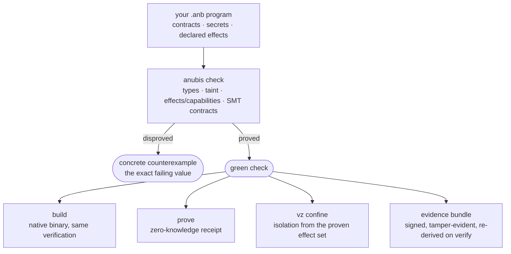

<div align="center">

# Anubis

### The language where a claim is *evidence*, not an assertion.


*The one invariant everything else serves: a green `anubis check` never certifies a contract that `anubis run` violates.*

</div>

---

## What Anubis actually is

Software's most consequential claims — *"this is correct," "this is secure," "this exploit is real," "this ran in isolation," "this dependency is what it says"* — are almost always **asserted**. Rarely **proven**. Never **handed to you as an artifact you can re-check yourself.**

**Anubis is a systems language that turns those claims into evidence.** Every statement it can make about a program comes out as something checkable and tamper-evident: a machine-checked proof, a concrete counterexample, a zero-knowledge receipt, a signed evidence bundle, a hash-chained action log, or a hardware-isolation manifest **derived from the proof itself.**

It is deliberately **dual-use**, because the two people who most need un-fakeable truth stand on opposite sides of the same program:

- the **builder** who must prove a system is *correct and confined*, and
- the **researcher** who must prove a system is *broken* — with a working, accountable proof-of-concept.

Both trade in the same currency — **truth that survives adversarial scrutiny** — and Anubis is the machine that mints it. Defense and offense are two faces of one idea: establish, and sign, exactly what is true about a program.

And Anubis earns the right to make those proofs by **trusting nothing it cannot check itself** — down to its own SMT solver (a native, Lean-verified core that already decides the integer lane with Z3 removed, opt-in), its own soundness (machine-checked in Lean 4), and its own compiler (self-hosted to a byte-identical fixpoint). It fails closed, everywhere, on purpose.

> **Where it is:** a real, gated, pre-1.0 language with a working safe execution core, a fail-closed contract verifier, an offensive/evidence toolchain, and Apple-Silicon proving lanes. Every capability below is marked with an honest status and is traceable to a command, a gate, or a file. Nothing is marked done that isn't sealed.

**The shape of it — one `check` decides everything downstream, and every green check becomes a re-checkable artifact:**



---

## The counterexample it hands you

A type system tells you a *shape* is wrong. Anubis tells you the *value* that is wrong — before you ship.

A ring buffer's slots-in-use is `tail - head`. Correct in mathematics; a bug in fixed-width code — once the buffer wraps and `tail < head`, the count goes negative. So you state the invariant:

```rust
fn ring_used(head: u32, tail: u32) -> u32
    ensures(result >= 0)
{
    return tail - head;
}
```

`anubis check` does not shrug and say "unproven." It **disproves** the claim with the wraparound state your tests never hit (the real SMT `sat` model, laid out for readability):

```
$ anubis check examples/showcase/ring_buffer_underflow.anb
ANUBIS_ASSERTION_UNPROVEN: ensures:(bvsge (bvsub anb_tail anb_head) (_ bv0 64))
  counterexample:                        # sat model, from the define-fun lines:
    anb_head = 0x00000000c0000000        # (_ BitVec 64)  = 3_221_225_472
    anb_tail = 0x0000000000000000        # (_ BitVec 64)  = 0  →  tail - head is negative
```

Fix it — subtract only where it can't underflow — and the **same solver proves the fix correct**. That counterexample is the evidence: [`examples/showcase/ring_buffer_underflow.anb`](examples/showcase/ring_buffer_underflow.anb).

> **Honest boundary.** Anubis's `u32` is a bounded 64-bit integer with *signed* arithmetic, so the failure it proves is "the count goes below zero," not "wraps to 4 billion" — the same bug, stated in the language's real semantics. An obligation the solver cannot decide within budget also **fails closed** (undecided ≠ proved).

---

## A whole program, proved *and* run — NEXUS

That counterexample is one obligation. **NEXUS** is the other end of the range: a
**472-line** self-verifying *cognitive kernel* that `anubis check` proves and
`anubis run` executes — one coherent program that exercises essentially the entire
language, and produces a hash-committed record of its own integrity *without revealing
what it deliberated about.*

```bash
anubis check examples/showcase/nexus/nexus_cognitive_kernel.anb   # → check passed
anubis run   examples/showcase/nexus/nexus_cognitive_kernel.anb   # → runs to a deterministic result
```

One file puts **9 Z3-verified contracts**, `secret<T>` private beliefs (checker-proved
no-leak), `trait` + `impl` dispatch, three `enum` kinds with `match` destructuring,
`Result`/`Option`, generics, the higher-order builtins (`map`/`filter`/`find`/`sort_by`/…),
and a `while … invariant(...)` integrity chain into a single program — and it still
checks clean *and* runs:

```
NEXUS cognitive cycle complete.
  + Contracts:    requires/ensures on 9 functions, Z3-proved
  + Beliefs:      secret<T>, contract-verified, never leaked
  + Integrity:    hash-chain, loop-invariant proved
The kernel proved its own cognitive integrity. It revealed NOTHING about what it deliberated.
```

Its information-flow half, [`nexus_checker_security.anb`](examples/showcase/nexus/nexus_checker_security.anb),
proves the `taint_source → declassify` discipline and capability-gated egress in the
checker lane. Full walkthrough: **[`examples/showcase/nexus/`](examples/showcase/nexus/)**.

---

## It proves its own math

Most verifiers lean on **Z3** — a large, external, unverified C++ trusted base. Anubis is removing it from the loop.

The [`solver/`](solver/) crate is a **from-scratch QF_BV decision procedure with zero external dependency** (`std` only, empty `[dependencies]`): an SMT-LIB2 parser, a Tseitin bit-blaster, and a CDCL SAT engine (watched literals, 1-UIP learning, VSIDS, Luby restarts). And every bit-blast the authoritative path relies on is **machine-checked in Lean 4 core** (no Mathlib) — the ripple-carry adder, all eight signed/unsigned comparators, equality, bitwise `& | ^ ~`, negation, both shifts, and the structural ops — the **entire operation surface a real integer contract emits, except division**, each proven equal to the runtime's `i64` semantics.

```bash
ANUBIS_NATIVE_AUTHORITATIVE=1 anubis check <int-contract>.anb   # decides the integer lane with Z3 removed from PATH
bash scripts/run_native_authoritative_gate.sh                   # verdict-equivalent to Z3 across the corpus, 0 disagreements
bash scripts/run_formal_gate.sh                                 # 150+ Lean 4 theorems across 14 modules, no sorry/admit/axiom
```

> **Honest boundary.** The flip is **opt-in**; by default Z3 stays the authority and **cross-checks every native verdict, failing closed on any disagreement**. What is proven today is the *encoding*. Dropping Z3 entirely awaits a checkable UNSAT certificate from the CDCL search — a residual that is named, not hidden.

---

## Everything Anubis can do

Status: ✅ **real** (implemented + gated) · 🟡 **partial** (real slices, honest boundary, fails closed on the rest) · ⬜ **planned** · 🔵 **needs human**

### 🛡️ Verify — prove your contracts, or get the counterexample

| | Status | |
|---|---|---|
| **Contract checking** | ✅ | `requires` / `ensures` / `assert` discharged by SMT, with real solver counterexamples; `--suggest-contracts` infers clauses for you |
| **Fail-closed build** | ✅ | `anubis build` runs the *same* verification and refuses on any unproven contract (`--no-verify` to opt out) |
| **Contract lanes** | 🟡 | integer (exact i64) ✅ · float **comparison** · string **equality/length** · bounded arrays · loop invariants · struct fields — **everything outside the modeled fragment fails closed** |
| **Native SMT solver** | ✅ | the zero-dependency, Lean-verified QF_BV solver above; Z3-droppable for the integer lane (opt-in) |
| **Mechanized soundness** | ✅ | 150+ Lean 4 theorems across 14 modules: encoding soundness, the bit-blaster, Safe-mode non-interference, effect soundness — `run_formal_gate.sh` proves the build carries **no `sorry`/`admit`/`axiom`** |

### 🔒 Secure by construction — types that stop data from leaking

| | Status | |
|---|---|---|
| **Information flow** | ✅ | `tainted<T>` (integrity) + `secret<T>` (confidentiality) tracked through the program; a secret reaching a public sink is a compile error unless routed through `declassify(value, policy, reason)` |
| **The lethal trifecta** | ✅ | a function that *reads private data*, *takes untrusted input*, **and** *can exfiltrate* is rejected — `ANUBIS_LETHAL_TRIFECTA`, the AI-agent exfiltration bug as a type error |
| **Effects & capabilities** | ✅ | transitive effect inference (`fs.read` `fs.write` `net.send` `shell` `time.now` `rand.gen`); linear **use-once** capability tokens (`cap_acquire`/`cap_use`) — reuse is `ANUBIS_CAPABILITY_REUSE` |
| **Implicit-flow warning** | 🟡 | branch-on-secret is *warned*, not rejected (explicit-flow tracking is sound; implicit is advisory) — a documented boundary, not a silent gap |

### 🧾 Prove (zero-knowledge) — attest a computation without revealing it

| | Status | |
|---|---|---|
| **Program-bound RISC Zero proving** | ✅ | `anubis prove --backend risc0` lowers `main()` to a real zkVM guest; `proof_assert` is an in-circuit constraint (a false one yields *no valid receipt*) |
| **Parameterized proofs + named journals** | ✅ | `--input-json`/`--input-file`; `proof_commit_u32`/`_bool` name public outputs; ImageID binds the *program*, the journal binds the *inputs* |
| **Private witnesses** | ✅ | inputs read via `proof_input_*` stay off the journal — prove `lo <= x <= hi` without revealing `x` |
| **Standalone receipt verification** | ✅ | `anubis verify-receipt --receipt … --image-id …` cold-verifies against ImageID |
| **Metal-hybrid rv32im lane** | 🟡 | vendored `risc0-circuit-rv32im` + CPU fallback; real on Tier-2 Apple Silicon, `ANUBIS_REQUIRE_METAL=1` fails closed elsewhere (no speed claim is made) |

### 🧱 Confine — hardware isolation derived from the proof

| | Status | |
|---|---|---|
| **Effect-derived confinement** | ✅ | `anubis vz confine <program>` derives an Apple Virtualization isolation manifest **from the program's proven effect set** — a second boundary consistent-*by-construction* with `anubis check`, sealed into evidence bundles and **re-derived on verify** (a forged grant fails closed) |
| **VM lifecycle (tart lane)** | ✅ | `anubis vz` create / boot / exec / snapshot / stop / delete — the full Virtualization.framework lifecycle behind one CLI, on Apple Silicon |
| **Native VZ backend** | 🟡 | a direct `objc2-virtualization` binding (`vz native-preflight`): a proven-net-free program gets a **true zero-NIC air-gap** (0 network devices, hypervisor-enforced); per-hostname egress is substrate-staged. Locally ad-hoc-signable (`scripts/build_signed_anubis.sh`) |

### ⚔️ Research — an accountable offensive toolchain (authorized use)

Anubis carries a full, **engagement-scoped** offensive platform for authorized security work — because a proof-of-concept is *also* evidence, and every offensive action is logged as a **tamper-evident, hash-chained receipt** you can verify. It runs, by design, inside disposable, network-isolated VZ guests.

| | Status | |
|---|---|---|
| **Bounty-grade PoC kit** | ✅ | cyclic patterns (`pattern-create`/`pattern-offset`), `p64` packing, `gadget-search`, a `target_run` harness, and **mutation fuzzing of local binaries** (`anubis fuzz`, real process crashes → crash evidence) |
| **Engagement platform (AOP)** | ✅ | scoped workspaces (`engage-init`, authorization charter), an HTTP/JSON C2 listener, beacon `agent-generate`, task queue, and a **fail-closed action-receipt hash chain** (`receipt-verify`) — every action is accountable |
| **Isolated execution** | ✅ | `vz-exploit` / `vz-fuzz` / `vz-c2-cycle` / `vz-stress` run the whole battery inside a crash- and egress-isolated guest — no host risk |
| **Reporting** | ✅ | `anubis bounty-report` turns an evidence bundle into a structured responsible-disclosure report |
| **High-risk primitives** | 🟡 | process injection and Windows lateral movement are **PLAN_ONLY** (emit a plan, never execute) — a deliberate safety boundary |

### 📦 Evidence, packages & crypto — sign the truth, ship it, re-check it

| | Status | |
|---|---|---|
| **Proof-Carrying Artifacts** | ✅ | `anubis build --evidence` → tamper-evident bundle: source Merkle root, HIR/MIR, taint traces, solver output, SARIF, hashes, Markdown report. `verify` re-derives the claim and fails closed on tamper; `keygen`/`sign` add Ed25519 signatures |
| **Proof-carrying packages** | ✅ | `anubis package` — `Anubis.toml`/`Anubis.lock` with content-`sha256` pins; a dependency's effect/taint/**contract** summaries are re-derived and enforced at the consumer's call sites; a signer `trust` store |
| **Crypto surface** | ✅ | boring primitives, RustCrypto-backed where a vetted crate exists (`sha2`, `aead`/`aes-gcm`, `ed25519-dalek`): SHA-256, HMAC (constant-time verify), AEAD, PBKDF2/Argon2, Ed25519 — via `import std.crypto`; never a novel construction. Post-quantum (ML-KEM/ML-DSA) is ⬜ a documented future path, never hand-rolled |
| **Standard library** | ✅ | 10 content-locked Anubis-source modules (`compiler/stdlib/std/`): `math` `collections` `iter` `result` `option` `io` `str` `crypto` `testing`, and `pwn` for the offensive lane |

### 🧰 Run, tool & self-host — a real language, day to day

| | Status | |
|---|---|---|
| **Executable core** | ✅ | Turing-complete: loops, recursion, mutation, enums + `match`, `for x in xs` / `for i in a..b`, structs, maps, closures, `Option`/`Result`/`?`, ~150 builtins — native Apple-Silicon executables |
| **Type system** | ✅ / 🟡 | bidirectional inference, traits + coherence; generics are runtime-erased + dynamically checked (not yet statically monomorphized); multi-file `import` resolution is 🟡 in progress |
| **Developer experience** | ✅ | `fmt` (self-verifying), `test` (`// EXPECT: PASS\|FAIL`), `doc` (Contracts section), `repl`, `lsp` (contract hovers), tree-sitter grammar + VS Code extension — `run_dx_gate.sh` (15/15) |
| **Self-hosting spine** | ✅ | `selfhost/` compiles itself: a real stage0→stage3 bootstrap sealed to a **byte-identical fixpoint**; and the **effect, type, and taint checker engines are now Anubis-authored too**, each differential-gated 0-disagreement vs the Rust checker (`run_{effect,capset,type,taint}_selfhost_gate.sh`) and VM-sealed; reproducibility + diverse-double-compile gates landed |

---

## Examples — verified to run

Each runs on the prebuilt binary — `anubis check <file>` (or as noted). The *reject*
demos each ship a matching *accept* guard, so you can see the checker is **precise, not
trigger-happy** — the same program with the leak removed passes.

| Program | What it shows |
|---|---|
| ⭐ **[NEXUS cognitive kernel](examples/showcase/nexus/)** (472 lines) | the **flagship** — a whole real program that `check` proves *and* `run` executes: 9 Z3 contracts, `secret<T>`, traits, enums, generics, HOF, and a proved loop-invariant integrity chain, all in one file |
| [`ring_buffer_underflow.anb`](examples/showcase/ring_buffer_underflow.anb) | the solver hands you the **counterexample** — `check` disproves `ensures(result >= 0)` at the wraparound state, then proves the fix |
| [`verified_private_settlement.anb`](examples/showcase/verified_private_settlement.anb) | **contracts + secrets in one file**: SMT-proved debit/credit over `secret<i64>` balances, and the info-flow lane guarantees nothing private leaves |
| [`verified_loop.anb`](examples/showcase/verified_loop.anb) | a **loop invariant** discharged to establish a postcondition |
| [`suggest_contracts_demo.anb`](examples/showcase/suggest_contracts_demo.anb) | `check --suggest-contracts` **infers** the missing `requires`/`ensures` for you |
| [`tainted_input_to_shell_rejects.anb`](examples/security/tainted_input_to_shell_rejects.anb) | **command injection is a compile error** — `input() → shell()` is `ANUBIS_TAINTED_SINK_WITHOUT_DECLASSIFY` |
| [`http_trifecta_leg3_rejects.anb`](examples/security/http_trifecta_leg3_rejects.anb) | secret **+** untrusted input **+** network egress → `ANUBIS_LETHAL_TRIFECTA` (the AI-agent exfil bug as a type error) |
| [`vz_confine_demo.anb`](examples/showcase/vz_confine_demo.anb) | **the proof drives the hypervisor** — `vz confine` derives isolation from the program's proven effect set |
| [`amnesia_unlearning_witness.anb`](examples/showcase/amnesia_unlearning_witness.anb) | a **machine-unlearning deletion witness** — `run --allow-research` over before/after manifests: verdict PASS on a clean purge, FAIL when data is retained ([how to run](examples/showcase/AMNESIA.md)) |
| [`ennead_consensus_kernel.anb`](examples/industry/ennead_consensus_kernel.anb) | Z3 proves a **BFT consensus kernel can't split-brain** (quorum-intersection, with a negative control) |

---

## Where Anubis is — honest phase status

An 11-phase maturity arc; the living source of truth is [`docs/language/ROADMAP.md`](docs/language/ROADMAP.md).

| Phase | State | What that means today |
|---|---|---|
| **0 — Trust spine** | ✅ Done | reproducible build + real self-host bootstrap + byte-identical fixpoint seal (re-sealed on each checker slice; current VM fixpoint pinned in `scripts/vm/EXPECTED_FIXPOINT_VM`) |
| **1 — Type system** | ✅ Done | bidirectional inference, generics, traits + coherence — enforcing |
| **2 — Capability & effect** | ✅ Done | transitive effects, linear capability tokens, the **lethal trifecta as a compile error** |
| **3 — Verified surface** | 🟢 At DoD | SMT contract lanes for int / float / string / arrays / loops / structs; everything outside fails closed |
| **4 — Port checker into Anubis** | 🟢 At DoD | all three semantic engines — **effect, type, taint** — are now Anubis-authored in `selfhost/` and **match the Rust checker** (each differential-gated 0-disagreement and VM-sealed); parse + codegen were already self-hosted. Residuals are structural (type HM/generics — unreachable in the self-host grammar) or deferred-precision (taint closure/container interproc, where the self-hosted engine soundly under-reports) |
| **5 — Mechanized soundness** | 🟢 At DoD | 150+ Lean 4 theorems across 14 modules: encoding soundness, the native bit-blaster, non-interference, effect soundness — no `sorry`/`admit`/`axiom` |
| **6 — Proof-carrying packages** | 🟢 At DoD | signed bundles, re-derived-on-verify summaries, contract enforcement across dependencies |
| **7 — Minimize TCB** | 🟢 Advanced | the native, machine-checked SMT solver (Z3 droppable for integers, opt-in); residual: a mechanized UNSAT certificate + a second independently-authored frontend |
| **8 — Developer experience** | 🟢 At DoD | LSP, formatter, REPL, doc-gen, tree-sitter, tutorial, spec — `run_dx_gate.sh` (15/15) |
| **9 — External reproduction** | 🔵 Needs human | pinned-toolchain + hermetic-Docker + diverse-double-compile gates exist; independent-stranger reproduction is pending |
| **10 — Production 1.0** | 🔵 Needs human | real systems shipped in ≥2 domains; a frozen, semver'd 1.0 spec is an operator commitment |

**The discipline is auditable, not advertised.** Development happens on the `a-plus-maturity/20260705-1649` branch; the formal gate machine-checks the Lean proofs; every solver slice is sealed against the byte-identical self-host fixpoint before it may commit; and soundness is stress-tested by **whole-surface audits that build and run candidate programs** hunting for any case where a green check disagrees with the runtime. CI runs the same 15-gate front door a stranger runs on a fresh clone.

---

## Quick start

```bash
git clone https://github.com/AnubisQuantumCipher/anubis-lang.git && cd anubis-lang
cargo build --release -p anubis        # binary at ./target/release/anubis; the pinned
                                       # toolchain (rust-toolchain.toml) is selected for you

# ── Verify ────────────────────────────────────────────────────────────
anubis check examples/showcase/ring_buffer_underflow.anb   # prints a real counterexample
anubis check <yours>.anb --suggest-contracts               # infer requires/ensures
anubis run   examples/hello_normal.anb                     # execute the safe core

# ── The gates (the discipline, runnable) ──────────────────────────────
bash scripts/run_formal_gate.sh                            # Lean: 150+ theorems / 14 modules, no sorry/axiom
bash scripts/run_native_authoritative_gate.sh              # native solver ≡ Z3, Z3 droppable
bash scripts/run_selfhost_gate.sh out/selfhost             # stage0→3 bootstrap + fixpoint
bash scripts/run_dx_gate.sh out/dx                         # LSP / fmt / repl / tree-sitter (15/15)

# ── Evidence, packages, proving ───────────────────────────────────────
anubis build examples/research_poc.anubis --evidence --out out/poc
anubis verify out/poc && anubis report out/poc             # re-derive + read the bundle
anubis prove examples/proof/proof_factorial_input.anb \
      --backend risc0 --input-json '{"n":5}' --evidence     # zk receipt (journal = 120)

# ── Confine (Apple Silicon) ───────────────────────────────────────────
anubis vz confine examples/showcase/vz_confine_demo.anb    # isolation manifest from the proof
```

---

## Learn Anubis

| | |
|---|---|
| **Tutorial** | [`docs/language/TUTORIAL.md`](docs/language/TUTORIAL.md) |
| **Language reference** | [`LANGUAGE.md`](LANGUAGE.md) · [`docs/language/SPEC.md`](docs/language/SPEC.md) |
| **Roadmap (living status)** | [`docs/language/ROADMAP.md`](docs/language/ROADMAP.md) |
| **Information-flow model** | [`docs/language/INFORMATION_FLOW.md`](docs/language/INFORMATION_FLOW.md) |
| **Solver pipeline** | [`docs/SOLVER_PIPELINE_MAP.md`](docs/SOLVER_PIPELINE_MAP.md) · [`solver/README.md`](solver/README.md) |
| **Crypto / stdlib** | [`docs/language/CRYPTO.md`](docs/language/CRYPTO.md) · [`docs/language/STDLIB_CORE.md`](docs/language/STDLIB_CORE.md) |
| **Architecture map** | [`ARCHITECTURE_MAP.md`](ARCHITECTURE_MAP.md) |
| **Editors** | [`editors/vscode-anubis`](editors/vscode-anubis) (LSP + syntax) · [`editors/tree-sitter-anubis`](editors/tree-sitter-anubis) (grammar) |
| **Contributing / Security** | [`CONTRIBUTING.md`](CONTRIBUTING.md) · [`SECURITY.md`](SECURITY.md) · [`LICENSE`](LICENSE) (BUSL-1.1) |

---

## Honest boundaries

Anubis states exactly what it proves and what it does not:

- **`check` certifies contracts, not the absence of every runtime trap.** A contract-free function's in-body `assert` over its **integer** parameters is now modeled and enforced (state the precondition or it is disproved); a float/string assert the solver cannot model stays runtime-enforced (fail-open) — a documented, actively-narrowed stance.
- **The native-solver flip is opt-in** until the CDCL engine emits a checkable UNSAT certificate; by default Z3 is the authority and cross-checks every verdict.
- **Generics are runtime-erased**, multi-file `import` resolution is in progress, and implicit-flow is warned rather than rejected — each an explicit, fails-closed boundary, not a hidden gap.
- **The offensive platform is for authorized engagements**, isolated in VZ guests, with the riskiest primitives PLAN_ONLY and every action receipted.
- **Phases 9–10 (independent-stranger reproduction, a frozen 1.0 spec) are open** — neither is marked done; both are operator/third-party commitments, not code. (Phase 4 — self-hosting the effect/type/taint engines — reached DoD: all three now match the Rust checker on the self-host-expressible surface, differential-gated and sealed.)

---

## License & community

- **License** — Anubis is released under the **Business Source License 1.1** ([`LICENSE`](LICENSE)): the source is available to read, evaluate, and build on for any **non-production** purpose, and it converts to **Apache-2.0** on the Change Date. Production or commercial use before then needs a commercial license — contact **sic.tau@pm.me**. Deliberately source-available, not yet OSI open-source.
- **Contributing** — every change carries its own evidence and lands only when the gates stay green; the reproducible front door is `bash scripts/audit_a_plus.sh`. See [`CONTRIBUTING.md`](CONTRIBUTING.md) and the [`CODE_OF_CONDUCT.md`](CODE_OF_CONDUCT.md).
- **Security** — found a case where a green `anubis check` certifies something `anubis run` violates — a **false accept**? That is the bug class that matters most here. Report it privately per [`SECURITY.md`](SECURITY.md).
- **Repository note** — the tree vendors a patched RISC Zero (`vendor/`, wired via `[patch.crates-io]`) so the zkVM cold-verify gate reproduces from source; that accounts for most of the repo's size.

---

<div align="center">

**The math is the authority. The proofs are mechanized. The system fails closed.**

*That is what Anubis is — and what it is becoming.*

</div>
