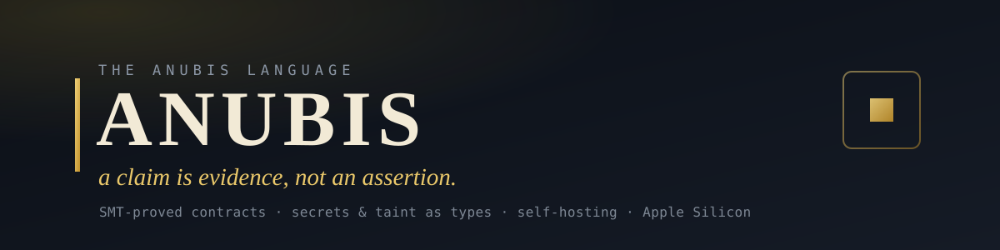

<div align="center">



<br><br>

[](https://github.com/AnubisQuantumCipher/anubis-lang/actions/workflows/ci.yml)


*The objective everything else serves: a green `anubis check` means the checker found no way for the
program to violate its stated contracts, effects, capabilities, or information-flow policy. Green
means no known defect; the load-bearing residual is always [`docs/CLAIMS.md`](docs/CLAIMS.md).*

</div>

---

## What Anubis actually is

Software's most consequential claims — *"this is correct," "this is secure," "this exploit is real," "this ran in isolation," "this dependency is what it says"* — are almost always **asserted**. Rarely **proven**. Never **handed to you as an artifact you can re-check yourself.**

**Anubis is a systems language that turns those claims into evidence.** Every statement it can make about a program comes out as something checkable and tamper-evident: a machine-checked proof, a concrete counterexample, a zero-knowledge receipt, a signed evidence bundle, a hash-chained action log, or a hardware-isolation manifest **derived from the proof itself.**

It is deliberately **dual-use**, because the two people who most need un-fakeable truth stand on opposite sides of the same program:

- the **builder** who must prove a system is *correct and confined*, and
- the **researcher** who must prove a system is *broken* — with a working, accountable proof-of-concept.

Both trade in the same currency — **truth that survives adversarial scrutiny** — and Anubis is the machine that mints it. Defense and offense are two faces of one idea: establish, and sign, exactly what is true about a program.

And Anubis earns the right to make those proofs by **trusting nothing it cannot check itself** — down to its own SMT solver (a native, Lean-verified core that decides the integer lane by default with Z3 as fail-closed cross-check; opt-out `ANUBIS_NATIVE_AUTHORITATIVE=0`), its own soundness (machine-checked in Lean 4), and its own compiler (self-hosted to a byte-identical fixpoint). It fails closed by design and by default — and where it does not yet, the gap is published rather than papered over: `docs/CLAIMS.md` carries the bounded residual for `anubis run` (76 sealed cells; the crypto slice unmeasured) alongside the named open items.

> **Where it is:** a real, gated, pre-1.0 language with a working safe execution core, a fail-closed contract verifier, an offensive/evidence toolchain, and Apple-Silicon proving lanes. Every capability below is marked with an honest status and is traceable to a command, a gate, or a file. Nothing is marked done that isn't sealed.

**The shape of it — one `check` decides everything downstream, and every green check becomes a re-checkable artifact:**


---

## The counterexample it hands you

A type system tells you a *shape* is wrong. Anubis tells you the *value* that is wrong — before you ship.

A ring buffer's slots-in-use is `tail - head`. Correct in mathematics; a bug in fixed-width code — once the buffer wraps and `tail < head`, the count goes negative. So you state the invariant:

```rust
fn ring_used(head: u32, tail: u32) -> u32
    ensures(result >= 0)
{
    return tail - head;
}
```

`anubis check` does not shrug and say "unproven." It **disproves** the claim with the wraparound state your tests never hit — code `ANUBIS_ASSERTION_DISPROVED`, with a pretty-printed sat model (not the conflated "or undecided" path):

```
$ anubis check examples/showcase/ring_buffer_underflow.anb
ANUBIS_ASSERTION_DISPROVED: 1 assertion(s) disproved by counterexample:
  ensures:(bvsge (bvsub anb_tail anb_head) (_ bv0 64))
  counterexample:
    head = 0x00000000c0000000  (3221225472)
    tail = 0x0000000000000000  (0)
```

Fix it — subtract only where it can't underflow — and the **same solver proves the fix correct**. That counterexample is the evidence: [`examples/showcase/ring_buffer_underflow.anb`](examples/showcase/ring_buffer_underflow.anb).

**Wrap-safety (Anubis AoRTE-lite).** When the checker already models your integer params, it also proves that `+`/`-`/`*` cannot *signed-wrap* under free inputs — or it fails with `ANUBIS_WRAP_RISK`, the concrete witness, and a paste-ready `possible fix: requires(x < …)`. That is SPARK’s overflow story with Anubis counterexamples. Opt out: `ANUBIS_WRAP_SAFETY=0`. Honest SPARK comparison: [`docs/SPARK_VS_ANUBIS.md`](docs/SPARK_VS_ANUBIS.md).

> **Honest boundary.** Anubis's `u32` is a bounded 64-bit integer with *signed* arithmetic, so the failure it proves is "the count goes below zero," not "wraps to 4 billion" — the same bug, stated in the language's real semantics. An obligation the solver cannot decide within budget also **fails closed** (undecided ≠ proved). Runtime still **wraps** unless you bound inputs.

---

## The showcase — NEXUS, a secure AI agent the compiler keeps honest

This is what Anubis is *for*. **NEXUS is an autonomous AI agent whose safety is proved
by the compiler — not promised by a system prompt.**

Every AI-agent security failure of the moment — a prompt-injected agent that
exfiltrates a secret, a tool-using agent that over-acts, an agent you have to *trust*
because you can't inspect its reasoning — is, in NEXUS, either a **compile error** or a
**machine-checked proof**:

| The agent must… | …and Anubis makes it a property, not a promise |
|---|---|
| **keep private beliefs secret** | its beliefs are `secret<T>`; the checker proves no secret ever reaches a public sink — **a leak is a compile error**, not a runtime incident |
| **not be hijacked by untrusted input** | every sensor and command is a `taint_source` that **must** be validated and `declassify`-ed with an auditable *policy + reason* before the agent may act on it — unsanitized influence is rejected |
| **not over-act** | outbound action is a **linear, use-once capability** — `cap_acquire("net.send")` then `cap_use`: it earns the right to broadcast exactly once and spends it exactly once |
| **never combine all three** | reads-private **+** untrusted-input **+** can-exfiltrate — *the lethal trifecta*, the canonical agent-exfiltration bug — is `ANUBIS_LETHAL_TRIFECTA`; NEXUS passes only because it routes every flow through validation, declassify, and a spent capability |
| **be auditable without exposing its thoughts** | it emits a **hash-committed record of its own cognitive integrity** — evidence it reasoned inside its safety envelope — while the beliefs themselves (`secret<T>`) never leave |

And it is a real program, not a diagram: **475 lines** that `check` clean **and** `run` —
9 Z3-verified contracts, `trait` dispatch, three `enum` kinds, generics, the
higher-order builtins, and a proved `while … invariant(...)` integrity chain.

```bash
anubis check examples/showcase/nexus/nexus_cognitive_kernel.anb   # → check passed
anubis run   examples/showcase/nexus/nexus_cognitive_kernel.anb   # → runs; proves its own integrity
```

```
[Phase 3] Private belief formation: secret<T>, contract-verified
  beliefs formed and fused (secret<i64> — checker enforces no leak)
  Z3 proved: 0 <= fused < 10000, 0 <= surprise < 10000
...
The kernel proved its own cognitive integrity. It revealed NOTHING about what it deliberated.
```

The information-flow half — [`nexus_checker_security.anb`](examples/showcase/nexus/nexus_checker_security.anb) —
is where the `taint_source → declassify` discipline and the capability-gated broadcast
are proved in the checker lane (`anubis check --verified` → passed). Full walkthrough:
**[`examples/showcase/nexus/`](examples/showcase/nexus/)**.

### Also showcase — Anubis Vault (high-threat password manager)

**[`examples/showcase/anubis_vault/`](examples/showcase/anubis_vault/)** is a second full
showcase application: a CLI password / contacts vault for high-threat ops (dual REAL/DURESS
worlds, Argon2id 19 MiB, ChaCha20-Poly1305, verified-lane linear `fs.write`/`fs.read` caps,
build-once multi-op product binary, in-language `delete_file` destroy, confinement with **no
`net.send`**). Selftest **16/16**; product battery **76/0** (`scripts/thorough_test.sh`).

```bash
anubis check --verified examples/showcase/anubis_vault/vault.anb
anubis run examples/showcase/anubis_vault/vault.anb --allow-research   # → SELFTEST GATE PASSED: 16/16
anubis build examples/showcase/anubis_vault/vault_contacts.anb -o examples/showcase/anubis_vault/product
# then multi-op without recompile: product/anubis_out create|verify|list|delete-one|delete-all|destroy
```

> **Why it matters.** The guarantees that AI-agent frameworks today write into a system
> prompt and *hope* hold — "don't leak the key," "don't act on injected instructions,"
> "only use the tools you were given" — NEXUS turns into properties the compiler
> refuses to build without.

---

## It proves its own math

Most verifiers lean on **Z3** — a large, external, unverified C++ trusted base. Anubis is removing it from the loop.

The [`solver/`](solver/) crate is a **from-scratch QF_BV decision procedure with zero external dependency** (`std` only, empty `[dependencies]`): an SMT-LIB2 parser, a Tseitin bit-blaster, and a CDCL SAT engine (watched literals, 1-UIP learning, VSIDS, Luby restarts). And every bit-blast the authoritative path relies on is **machine-checked in Lean 4 core** (no Mathlib) — the ripple-carry adder, all eight signed/unsigned comparators, equality, bitwise `& | ^ ~`, negation, both shifts, and the structural ops — the **entire operation surface a real integer contract emits, except division**, each proven equal to the runtime's `i64` semantics.

```bash
anubis check <int-contract>.anb                                 # native-authoritative by default (proven int fragment)
ANUBIS_NATIVE_AUTHORITATIVE=0 anubis check <int-contract>.anb   # opt out → z3-only authority
bash scripts/run_native_authoritative_gate.sh                   # cert + ≡ Z3 corpus + TCB-drop + fragment danger
bash scripts/run_formal_gate.sh                                 # 162 Lean 4 theorems across 15 modules, no sorry/admit/axiom
```

> **Honest boundary.** **Default (2026-07-25):** native-authoritative on the machine-checked integer fragment — Unsat only after a **verified pure RUP certificate** (`solver/src/lrat.rs`), Sat only after independent model replay. Z3 **cross-checks every native verdict when present**, failing closed on disagreement. **Opt out:** `ANUBIS_NATIVE_AUTHORITATIVE=0`. **Division / remainder** (`bvsdiv`/`bvsrem`/`bvudiv`/`bvurem`) stay z3-deferred — the only op class a real integer contract emits that the native lane declines. Variable×variable multiply is **not** deferred: it is machine-checked (`mulVar_correct`, `formal/Anubis/BitBlast.lean`) and admitted by the fragment gate (`MulVar` in `PROVEN_OP_TAGS`). `bvashr`/`sign_extend` are listed deferred but unreachable — the encoder spells `>>` and widening casts with proven ops only.

---

## Everything Anubis can do

Status: ✅ **real** (implemented + gated) · 🟡 **partial** (real slices, honest boundary, fails closed on the rest) · ⬜ **planned** · 🔵 **needs human**

### 🛡️ Verify — prove your contracts, or get the counterexample

| | Status | |
|---|---|---|
| **Contract checking** | ✅ | `requires` / `ensures` / `assert` discharged by SMT, with real solver counterexamples; `--suggest-contracts` infers clauses for you |
| **Verified build front door** | ✅ | Without the explicit `--no-verify` escape hatch, `anubis build` runs the same checker and refuses the currently modeled unproven-contract cases; whole-language residuals remain in [`docs/CLAIMS.md`](docs/CLAIMS.md) |
| **Contract lanes** | 🟡 | integer (exact i64) ✅ · float **comparison** · string **equality/length** · bounded arrays · loop invariants · struct fields — **everything outside the modeled fragment fails closed** |
| **Native SMT solver** | ✅ | the zero-dependency, Lean-verified QF_BV solver above; **default-authoritative** on the proven integer fragment (opt-out `=0`); Z3 cross-checks when present |
| **Mechanized components** | ✅ | 162 Lean 4 theorems across 15 modules cover the stated encoding, bit-blast, non-interference, and effect lemmas; `run_formal_gate.sh` checks those theorem files and rejects `sorry`/`admit`/`axiom`. This is not a proof of total language soundness |

### 🔒 Secure by construction — types that stop data from leaking

| | Status | |
|---|---|---|
| **Information flow** | 🟡 | `tainted<T>` (integrity) + `secret<T>` (confidentiality) are enforced across the currently instrumented carriers; the named sink fixtures reject unless routed through `declassify(value, policy, reason)`. Composition completeness is not claimed; see [`docs/CLAIMS.md`](docs/CLAIMS.md) |
| **The lethal trifecta** | 🟡 | the named direct and summarized forms that *read private data*, *take untrusted input*, **and** *can exfiltrate* reject with `ANUBIS_LETHAL_TRIFECTA`; residual composition shapes remain governed by [`docs/CLAIMS.md`](docs/CLAIMS.md) |
| **Effects & capabilities** | ✅ | transitive effect inference (`fs.read` `fs.write` `net.send` `shell` `time.now` `rand.gen`); linear **use-once** capability tokens (`cap_acquire`/`cap_use`) — reuse is `ANUBIS_CAPABILITY_REUSE` |
| **Implicit-flow rejection** | 🟡 | named assignment-to-public forms under a secret program counter reject with `ANUBIS_IMPLICIT_FLOW` — covering the cited `if`/`match`/guard/loop/`if let` fixtures in statement and value position. **Honest boundary:** full Jif/FlowCaml-style PC labelling at every join is not implemented, so behavior outside those fixtures is a named residual, not claimed fail-closed |

### 🧾 Prove (zero-knowledge) — attest a computation without revealing it

| | Status | |
|---|---|---|
| **Program-bound RISC Zero proving** | ✅ | `anubis prove --backend risc0` lowers `main()` to a real zkVM guest; `proof_assert` is an in-circuit constraint (a false one yields *no valid receipt*) |
| **Parameterized proofs + named journals** | ✅ | `--input-json`/`--input-file`; `proof_commit_u32`/`_bool` name public outputs; ImageID binds the *program*, the journal binds the *inputs* |
| **Private witnesses** | ✅ | inputs read via `proof_input_*` stay off the journal — prove `lo <= x <= hi` without revealing `x` |
| **Standalone receipt verification** | ✅ | `anubis verify-receipt --receipt … --image-id …` cold-verifies against ImageID |
| **Metal-hybrid rv32im lane** | 🟡 | vendored `risc0-circuit-rv32im` + CPU fallback; real on Tier-2 Apple Silicon, `ANUBIS_REQUIRE_METAL=1` fails closed elsewhere (no speed claim is made) |

### 🧱 Confine — hardware isolation derived from the proof

| | Status | |
|---|---|---|
| **Effect-derived confinement** | 🟡 | `anubis vz confine <program>` derives a manifest from the checker's emitted effect set; the named bundle/tamper controls re-derive and byte-compare it on verify. This is evidence for the declared schema, not proof that effect discovery is complete |
| **VZ apply mount posture** | 🟡 | the named apply-gate cases show `none` denying and `read-only` forcing `:ro`; unenumerated apply combinations are not covered by that observation |
| **VZ apply network posture** | ✅ | No open NAT by default; `--allow-host` → Softnet default-deny + `/32` allows when `softnet` is on PATH; `--allow-open-nat` explicit residual |
| **Effect-derived entitlement profile** | 🟡 | `anubis entitlements <program>` derives a profile from the checker's emitted effect set; named verification controls re-derive it. **Derived profile, not enforced until signed** (`apple_enforced_claim: false`) |
| **Non-exportable linear caps + Keychain/SE** | ✅ | Static export-seal; macOS Keychain bind (`kc:`) under signed Development path; optional SE (`se:`); soft fallback; gate `scripts/run_keychain_se_gate.sh` |
| **VM lifecycle (tart lane)** | ✅ | `anubis vz` create / boot / exec / snapshot / stop / delete — the full Virtualization.framework lifecycle behind one CLI, on Apple Silicon |
| **Native VZ backend** | 🟡 | `vz native-preflight` validates the generated configuration and its named negative control; the net-free configuration contains zero network devices. Per-hostname egress is substrate-staged, so no broader air-gap claim follows |

### ⚔️ Research — an accountable offensive toolchain (authorized use)

Anubis carries a full, **engagement-scoped** offensive platform for authorized security work — because a proof-of-concept is *also* evidence, and every offensive action is logged as a **tamper-evident, hash-chained receipt** you can verify. It runs, by design, inside disposable, network-isolated VZ guests.

| | Status | |
|---|---|---|
| **Bounty-grade PoC kit** | ✅ | cyclic patterns (`pattern-create`/`pattern-offset`), `p64` packing, `gadget-search`, a `target_run` harness, and **mutation fuzzing of local binaries** (`anubis fuzz`, real process crashes → crash evidence) |
| **Engagement platform (AOP)** | ✅ | scoped workspaces (`engage-init`, authorization charter), an HTTP/JSON C2 listener, beacon `agent-generate`, task queue, and a **fail-closed action-receipt hash chain** (`receipt-verify`) — every action is accountable |
| **Isolated execution** | ✅ | Host control plane `vz-status`/`vz-start`/`vz-exec`/… drives **Tart** (same as `anubis vz`). Live offensive work and `vz-stress` (= disposable-guest gate `scripts/run_offensive_platform_gate.sh`) run inside crash-isolated guests — not on the host |
| **Reporting** | ✅ | `anubis bounty-report` turns an evidence bundle into a structured responsible-disclosure report |
| **High-risk primitives** | 🟡 | process injection is **PLAN_ONLY by default**; live inject requires double authorization. SMB/WinRM lateral remains **PLAN_ONLY** (never executes) |

### 📦 Evidence, packages & crypto — sign the truth, ship it, re-check it

| | Status | |
|---|---|---|
| **Proof-Carrying Artifacts** | ✅ | `anubis build --evidence` → tamper-evident bundle: source Merkle root, HIR/MIR, taint traces, solver output, SARIF, hashes, Markdown report. `verify` re-derives the claim and fails closed on tamper; `keygen`/`sign` add Ed25519 signatures |
| **Proof-carrying packages** | ✅ | `anubis package` — `Anubis.toml`/`Anubis.lock` with content-`sha256` pins; a dependency's effect/taint/**contract** summaries are re-derived and enforced at the consumer's call sites; a signer `trust` store |
| **Crypto surface** | ✅ | boring primitives, RustCrypto-backed where a vetted crate exists (`sha2`, `aead`/`aes-gcm`, `ed25519-dalek`): SHA-256, HMAC (constant-time verify), AEAD, PBKDF2/Argon2, Ed25519 — via `import std.crypto`; never a novel construction. Post-quantum (ML-KEM/ML-DSA) is ⬜ a documented future path, never hand-rolled |
| **Standard library** | ✅ | 13 content-locked Anubis-source modules (`compiler/stdlib/std/`): `math` `collections` `iter` `result` `option` `io` `str` `crypto` `net` `rand` `time` `testing`, and `pwn` for the offensive lane |

### 🧰 Run, tool & self-host — a real language, day to day

| | Status | |
|---|---|---|
| **Executable core** | ✅ | Turing-complete: loops, recursion, mutation, enums + `match`, `for x in xs` / `for i in a..b`, structs, maps, closures, `Option`/`Result`/`?`, **213 builtins** (inventory: [`docs/language/BUILTINS.md`](docs/language/BUILTINS.md)) — native Apple-Silicon executables |
| **Type system** | ✅ / 🟡 | bidirectional inference, traits + coherence; generics are runtime-erased + dynamically checked (not yet statically monomorphized); multi-file `import` resolution is 🟡 in progress |
| **Developer experience** | ✅ | `fmt` (self-verifying), `test` (`// EXPECT: PASS\|FAIL`), `doc` (Contracts section), `repl`, `lsp` (contract hovers), tree-sitter grammar + VS Code extension — `run_dx_gate.sh` (15/15) |
| **Self-hosting spine** | 🟡 | `selfhost/` implements a stage0→stage3 bootstrap plus Anubis-authored effect, type, and taint engines. The named differential gates report the corpus comparison; the post-registry VM fixpoint is currently **unsealed** and must not be represented as current proof (see [`docs/CLAIMS.md`](docs/CLAIMS.md)) |

---

## Examples — verified to run

Each runs on the prebuilt binary — `anubis check <file>` (or as noted). The *reject*
demos each ship a matching *accept* guard, so you can see the checker is **precise, not
trigger-happy** — the same program with the leak removed passes.

| Program | What it shows |
|---|---|
| ⭐ **[NEXUS](examples/showcase/nexus/)** — secure AI agent (475 lines) | the **flagship fixture**: its checked source exercises private-state, untrusted-input, capability-egress, and integrity controls; `check` and `run` are the evidence for this program, not a total-language proof |
| ⭐ **[Anubis Vault](examples/showcase/anubis_vault/)** — high-threat password manager | operational CLI vault: Argon2id + AEAD + dual/duress worlds + clearance/burn + **verified-lane caps that run** + build-once multi-op contacts CRUD + real unlink destroy; `check --verified` and `run` both green; thorough battery in-tree |
| [`ring_buffer_underflow.anb`](examples/showcase/ring_buffer_underflow.anb) | the solver hands you the **counterexample** — `check` disproves `ensures(result >= 0)` at the wraparound state, then proves the fix |
| [`verified_private_settlement.anb`](examples/showcase/verified_private_settlement.anb) | **contracts + secrets in one file**: the named SMT debit/credit obligations discharge and the fixture's explicit secret-to-public guards reject |
| [`verified_loop.anb`](examples/showcase/verified_loop.anb) | a **loop invariant** discharged to establish a postcondition |
| [`suggest_contracts_demo.anb`](examples/showcase/suggest_contracts_demo.anb) | `check --suggest-contracts` **infers** the missing `requires`/`ensures` for you |
| [`tainted_input_to_shell_rejects.anb`](examples/security/tainted_input_to_shell_rejects.anb) | **command injection is a compile error** — `input() → shell()` is `ANUBIS_TAINTED_SINK_WITHOUT_DECLASSIFY` |
| [`http_trifecta_leg3_rejects.anb`](examples/security/http_trifecta_leg3_rejects.anb) | secret **+** untrusted input **+** network egress → `ANUBIS_LETHAL_TRIFECTA` (the AI-agent exfil bug as a type error) |
| [`vz_confine_demo.anb`](examples/showcase/vz_confine_demo.anb) | **the proof drives the hypervisor** — `vz confine` derives isolation from the program's proven effect set |
| [`amnesia_unlearning_witness.anb`](examples/showcase/amnesia_unlearning_witness.anb) | a **machine-unlearning deletion witness** — `run --allow-research` over before/after manifests: verdict PASS on a clean purge, FAIL when data is retained ([how to run](examples/showcase/AMNESIA.md)) |
| [`ennead_consensus_kernel.anb`](examples/industry/ennead_consensus_kernel.anb) | Z3 proves a **BFT consensus kernel can't split-brain** (quorum-intersection, with a negative control) |
| [`hall_of_two_truths.anb`](examples/hall_of_two_truths.anb) | language stress demo — structs/enums/maps/sort/hash-chain journal; `check` + `run` |
| [`hermes_dual_path_seal.anb`](examples/hermes_dual_path_seal.anb) | dual-path agreement seal (fact/sum/collatz/risk journal → Clear) |
| [`anpu_recursive_sdf_renderer.anb`](examples/anpu_recursive_sdf_renderer.anb) | recursive SDF ray-march + deterministic receipt (`ANUBIS_PROOF_INPUTS=proof_mode=0,challenge=0`) |
| [`programs/formal_kernel/`](examples/programs/formal_kernel/) | pure-Anubis SAT kernel + independent Python oracle (12/12) |
| [`programs/double_entry_ledger/`](examples/programs/double_entry_ledger/) · [`expense_ledger/`](examples/programs/expense_ledger/) | accounting demos with balance invariants under `check`/`run` |
| [`programs/snake/`](examples/programs/snake/) | pure-Anubis Snake (`play.sh` caches native binary for instant board) |

---

## Where Anubis is — honest phase status

An 11-phase maturity arc; the living source of truth is [`docs/language/ROADMAP.md`](docs/language/ROADMAP.md).

| Phase | State | What that means today |
|---|---|---|
| **0 — Trust spine** | 🟡 Partial | reproducible-build and self-host gates exist; `scripts/vm/EXPECTED_FIXPOINT_VM` records the historical VM expectation, while the post-registry VM re-seal remains pending in [`docs/CLAIMS.md`](docs/CLAIMS.md) |
| **1 — Type system** | ✅ Done | bidirectional inference, generics, traits + coherence — enforcing |
| **2 — Capability & effect** | 🔴 Not soundness-complete | transitive effects, linear capability tokens, and named lethal-trifecta fixtures exist; field/walker parity remains the load-bearing residual |
| **3 — Verified surface** | 🟡 Scoped | SMT contract lanes for the named int / float / string / array / loop / struct fragments; behavior outside the enumerated negative controls remains governed by [`docs/CLAIMS.md`](docs/CLAIMS.md) |
| **4 — Port checker into Anubis** | 🟡 Partial | all three semantic engines — **effect, type, taint** — are Anubis-authored in `selfhost/`; the named differential gates measure agreement on their declared corpora. The post-registry VM re-seal and broader self-host grammar remain residuals |
| **5 — Mechanized components** | 🟡 Scoped | `bash scripts/run_formal_gate.sh` checks 162 Lean 4 theorems across 15 modules and rejects `sorry`/`admit`/`axiom`; this does not close the whole-language false-accept class |
| **6 — Proof-carrying packages** | 🟡 Scoped | the package gate exercises signed bundles, re-derived summaries, tamper controls, and named dependency-contract cases; universal dependency closure is not claimed |
| **7 — Minimize TCB** | 🟢 Advanced | native QF_BV solver + Lean bit-blast + **verified RUP Unsat cert**; **default = native-authoritative** (opt-out `=0`); residual: second independently-authored frontend; division deferred |
| **8 — Developer experience** | 🟢 At DoD | LSP, formatter, REPL, doc-gen, tree-sitter, tutorial, spec — `run_dx_gate.sh` (15/15) |
| **9 — External reproduction** | 🟢 Done (witnessed) | independent clean-clone stranger run recorded: selfhost 9/9, repro 6/6 (Docker hermetic), DDC 34/34, fixtures 244/244, formal PASS — [`docs/language/phase9_independent_witness/`](docs/language/phase9_independent_witness/) |
| **10 — Production 1.0** | 🟢 Done (freeze) | [`SPEC_1_0_FREEZE.md`](docs/language/SPEC_1_0_FREEZE.md) + [`SEMVER_1_0_POLICY.md`](docs/language/SEMVER_1_0_POLICY.md); multi-party Phase 9 witnesses; package/DX gates green |

**The discipline is intended to be auditable.** The formal gate machine-checks the in-tree Lean
proofs, the seal checklist exercises its declared gate set, and adversarial audits build and run
candidate programs looking for check/runtime disagreement. Those are bounded observations—not a
proof that the candidate space or all future commits are covered; the living residual is
[`docs/CLAIMS.md`](docs/CLAIMS.md).

---

## Quick start

```bash
git clone https://github.com/AnubisQuantumCipher/anubis-lang.git && cd anubis-lang
cargo build --release -p anubis        # binary at ./target/release/anubis; the pinned
                                       # toolchain (rust-toolchain.toml) is selected for you
# Prefer ./target/release/anubis over bare `anubis` — a shell alias may hijack the name.

# ── Hello (must print) ────────────────────────────────────────────────
./target/release/anubis check examples/hello.anb
./target/release/anubis run   examples/hello.anb           # → hello from anubis

# ── Verify ────────────────────────────────────────────────────────────
./target/release/anubis check examples/showcase/ring_buffer_underflow.anb   # real counterexample
./target/release/anubis check examples/secret_declassify_hello.anb           # secret construction
./target/release/anubis run   examples/secret_declassify_hello.anb           # → 49
./target/release/anubis check <yours>.anb --suggest-contracts               # infer requires/ensures
./target/release/anubis run   examples/hello_normal.anb                     # another safe hello

# ── The gates (the discipline, runnable) ──────────────────────────────
bash scripts/run_formal_gate.sh                            # Lean: 162 theorems / 15 modules, no sorry/axiom
bash scripts/run_native_authoritative_gate.sh              # native default-authoritative; ≡ Z3; opt-out=0
bash scripts/run_selfhost_gate.sh out/selfhost             # stage0→3 bootstrap + fixpoint
bash scripts/run_dx_gate.sh out/dx                         # LSP / fmt / repl / tree-sitter (15/15)

# ── Evidence, packages, proving ───────────────────────────────────────
./target/release/anubis build examples/research_poc.anubis --evidence --out out/poc
./target/release/anubis verify out/poc && ./target/release/anubis report out/poc
./target/release/anubis prove examples/proof/proof_factorial_input.anb \
      --backend risc0 --input-json '{"n":5}' --evidence     # zk receipt (journal = 120)

# ── Confine (Apple Silicon) ───────────────────────────────────────────
./target/release/anubis vz confine examples/showcase/vz_confine_demo.anb
```

---

## Learn Anubis

| | |
|---|---|
| **Tutorial** | [`docs/language/TUTORIAL.md`](docs/language/TUTORIAL.md) — hello, secrets, contracts |
| **Language reference** | [`LANGUAGE.md`](LANGUAGE.md) · [`docs/language/SPEC.md`](docs/language/SPEC.md) |
| **Builtin inventory (213)** | [`docs/language/BUILTINS.md`](docs/language/BUILTINS.md) — complete names incl. crypto/caps |
| **Roadmap (living status)** | [`docs/language/ROADMAP.md`](docs/language/ROADMAP.md) |
| **Information-flow model** | [`docs/language/INFORMATION_FLOW.md`](docs/language/INFORMATION_FLOW.md) — how to *construct* a `secret<T>` |
| **Solver pipeline** | [`docs/SOLVER_PIPELINE_MAP.md`](docs/SOLVER_PIPELINE_MAP.md) · [`solver/README.md`](solver/README.md) |
| **Crypto / stdlib** | [`docs/language/CRYPTO.md`](docs/language/CRYPTO.md) · [`docs/language/STDLIB_CORE.md`](docs/language/STDLIB_CORE.md) |
| **Architecture map** | [`ARCHITECTURE_MAP.md`](ARCHITECTURE_MAP.md) |
| **Editors** | [`editors/vscode-anubis`](editors/vscode-anubis) (LSP + syntax) · [`editors/tree-sitter-anubis`](editors/tree-sitter-anubis) (grammar) |
| **Contributing / Security** | [`CONTRIBUTING.md`](CONTRIBUTING.md) · [`SECURITY.md`](SECURITY.md) · [`LICENSE`](LICENSE) (BUSL-1.1) |

---

## Honest boundaries

Anubis states exactly what it proves and what it does not:

- **`check` certifies contracts, not the absence of every runtime trap.** A contract-free function's in-body `assert` over its **integer** parameters is now modeled and enforced (state the precondition or it is disproved); a float/string assert the solver cannot model stays runtime-enforced (fail-open) — a documented, actively-narrowed stance.
- **Native SMT is authoritative by default** on the proven fragment (RUP-certified Unsat; model-replayed Sat). Z3 still cross-checks when present. Opt out with `ANUBIS_NATIVE_AUTHORITATIVE=0`.
- **Generics are runtime-erased** and multi-file `import` resolution is in progress — each an explicit, fails-closed boundary, not a hidden gap. Implicit flow (assignment under a secret PC) is **rejected**, not merely warned; the named residual is full PC labelling at every join.
- **The offensive platform is for authorized engagements**, isolated in VZ guests, with the riskiest primitives PLAN_ONLY and every action receipted.
- **Phases 9–10 carry a witnessed run and a published freeze, and neither is a soundness seal.** Phase 9 has an independent clean-clone stranger reproduction on a DATED commit; the post-drift re-baseline is unsealed. Phase 10 publishes `SPEC_1_0_FREEZE.md` + `SEMVER_1_0_POLICY.md`. Both are green as ENGINEERING milestones, and neither discharges the soundness promise while `docs/CLAIMS.md` § "Open — load-bearing" stands. (Phase 4 — self-hosting the effect/type/taint engines — reached DoD: all three now match the Rust checker on the self-host-expressible surface, differential-gated and sealed.)

---

## License & community

- **License** — Anubis is released under the **Business Source License 1.1** ([`LICENSE`](LICENSE)): the source is available to read, evaluate, and build on for any **non-production** purpose, and it converts to **Apache-2.0** on the Change Date. Production or commercial use before then needs a commercial license — contact **sic.tau@pm.me**. Deliberately source-available, not yet OSI open-source.
- **Contributing** — every change carries its own evidence and lands only when the gates stay green; the reproducible front door is `bash scripts/audit_a_plus.sh`. See [`CONTRIBUTING.md`](CONTRIBUTING.md) and the [`CODE_OF_CONDUCT.md`](CODE_OF_CONDUCT.md).
- **Security** — found a case where a green `anubis check` certifies something `anubis run` violates — a **false accept**? That is the bug class that matters most here. Report it privately per [`SECURITY.md`](SECURITY.md).
- **Repository note** — the tree vendors a patched RISC Zero (`vendor/`, wired via `[patch.crates-io]`) so the zkVM cold-verify gate reproduces from source; that accounts for most of the repo's size.

---

<div align="center">

**The math is the authority. The proofs are mechanized. The system fails closed.**

*That is what Anubis is — and what it is becoming.*

</div>
