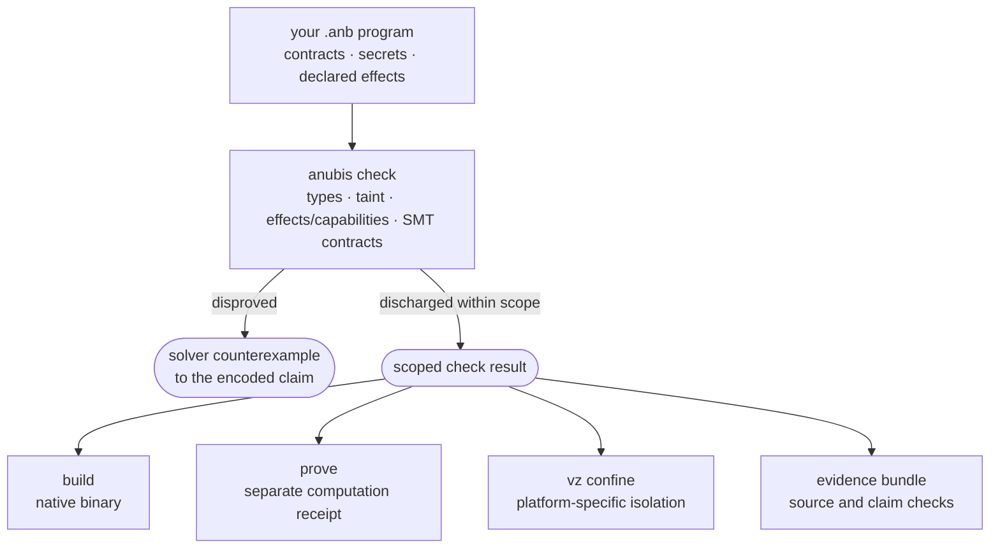

<div align="center">


<br><br>

[](https://github.com/AnubisQuantumCipher/anubis-lang/actions/workflows/ci.yml)
[](https://github.com/AnubisQuantumCipher/anubis-lang/releases/latest)


*A green `anubis check` reports the current checker's scoped results. It is not a proof that every
necessary obligation was generated or discharged: known main-branch residuals are tracked in
[`docs/CLAIMS.md`](docs/CLAIMS.md). Deferred is not proved.*

</div>

---

## What Anubis is

Software's consequential claims — *"this is correct," "this is secure," "this exploit is real,"
"this ran in isolation"* — need precise scopes and evidence another party can inspect.

**Anubis is a systems language built to connect program claims to evidence.** For supported claims
it can produce solver results, counterexamples, proof-execution receipts, signed bundles, and
isolation manifests. These artifacts establish different things; their scopes and trusted
components are described in [proof correspondence](docs/PROOF_CORRESPONDENCE.md) and
[capabilities](docs/CAPABILITIES.md).

It is deliberately **dual-use**: a **builder** can seek evidence for a scoped program claim, while an
authorized **researcher** can document a defect with an accountable proof-of-concept. Each needs
clear assumptions and artifacts that can be checked independently.

Anubis aims to reduce what must be trusted. Its native SMT solver has mechanized models for a
declared fragment and checks certificates, but correspondence from all production code to those
models remains open. Z3 supplies cross-checking and obligations outside the native fragment. The
Anubis-authored compiler is still a self-hosting spine; the current production compiler is Rust.



---

## The counterexample it hands you

For supported solver obligations, Anubis can show values in a counterexample to the encoded claim.

A ring buffer might compute slots in use as `tail - head`. For an input where
`tail < head`, the modeled signed difference is negative, so a claimed
nonnegative count fails. State that invariant explicitly:

```rust
fn ring_used(head: u32, tail: u32) -> u32
    ensures(result >= 0)
{
    return tail - head;
}
```

For this supported obligation, `anubis check` **disproves** the claim with an
input where `tail < head`:

```
$ anubis check examples/showcase/ring_buffer_underflow.anb
ANUBIS_ASSERTION_DISPROVED: 1 assertion(s) disproved by counterexample:
  ensures:(bvsge (bvsub anb_tail anb_head) (_ bv0 64))
  counterexample:
    head = 0x00000000c0000000  (3221225472)
    tail = 0x0000000000000000  (0)
```

After a fix, check the revised source again. A discharged obligation covers its encoded claim and
recorded assumptions, not every possible property of the executable.

> **Honest boundary.** A `u32` annotation does not generally impose a runtime range. Ordinary
> integer arithmetic uses wrapping signed 64-bit values; explicit casts have their own width rules.
> This example checks whether the modeled count goes below zero. See [language semantics](LANGUAGE.md)
> for the exact rules. An undecided obligation is not a proof.

---

## Quick start

This preview's supported native and virtualization workflows are Apple Silicon oriented. Native
Linux support is under development in [draft PR #44](https://github.com/AnubisQuantumCipher/anubis-lang/pull/44);
it is not a released platform claim. Use the pinned Rust toolchain in `rust-toolchain.toml` and
install Z3 for cross-checking and obligations outside the native solver's fragment.

```bash
git clone https://github.com/AnubisQuantumCipher/anubis-lang.git && cd anubis-lang
cargo build --release -p anubis        # binary at ./target/release/anubis; the pinned
                                       # toolchain (rust-toolchain.toml) is selected for you
# Prefer ./target/release/anubis over bare `anubis` — a shell alias may hijack the name.

./target/release/anubis check examples/hello.anb
./target/release/anubis run   examples/hello.anb                             # → hello from anubis
./target/release/anubis check examples/showcase/ring_buffer_underflow.anb    # real counterexample
./target/release/anubis check <yours>.anb --suggest-contracts                # infer requires/ensures
```

Full install notes: [`docs/INSTALL.md`](docs/INSTALL.md) · then the
[tutorial](docs/language/TUTORIAL.md).

---

## What it can do

Seven capability groups, each with an honest status and a named boundary. The detail — including
what is currently **open** — is in **[`docs/CAPABILITIES.md`](docs/CAPABILITIES.md)**.

| | Group | In one line |
|---|---|---|
| 🛡️ | **Verify** | `requires`/`ensures`/`assert` obligations checked by SMT, with counterexamples where supported; native solver authority has a declared fragment |
| 🔒 | **Information flow & authority** | `secret<T>`, `tainted<T>`, and capability checks cover documented paths; known open leaks are tracked in [`docs/CLAIMS.md`](docs/CLAIMS.md) |
| 🧾 | **Prove** | `anubis prove --backend risc0` — a real zkVM receipt, with private witnesses that stay off the journal |
| 🧱 | **Confine** | `anubis vz confine` prepares a platform-specific isolation manifest from analyzed effects; enforcement and attestation have separate boundaries |
| ⚔️ | **Research** | an engagement-scoped offensive toolchain for authorized work, every action hash-chained into a receipt |
| 📦 | **Evidence & packages** | tamper-evident bundles, Ed25519 signing, and dependencies whose effect/taint/contract summaries are re-derived at your call sites |
| 🧰 | **Run & self-host** | General-purpose executable core, **213 builtins**, LSP/fmt/REPL/tree-sitter, and an incomplete stage0→stage3 self-host spine |

**See it work:** [`docs/EXAMPLES.md`](docs/EXAMPLES.md) — including
[NEXUS](examples/showcase/nexus/), an AI-agent example exercising compiler checks, and
[Anubis Vault](examples/showcase/anubis_vault/), a password-manager example. These are examples,
not production-assurance certificates.

---

## Where it actually stands

Pre-1.0, under active development, and **honest about being unfinished**. Two things to understand
before you read any number here:

**1. A green gate is a scoped result.** Known soundness and precision defects remain in
[`docs/CLAIMS.md`](docs/CLAIMS.md). A passing check or CI run cannot erase them.

**2. Treat displayed counts as dated snapshots.** The gate checks configured inventories against
the tree, but the numbers here are maintained text, and historical test totals belong to their
source-bound receipts. This main-branch snapshot records security **337/337**, language **259/259**,
stdlib fail-closed **104/104**, native-authoritative over **937 files**, **213 builtins**, and
199 Lean 4 theorems across 16 modules (model-level, not end-to-end):

```bash
bash scripts/run_docs_drift_gate.sh    # checks configured inventory stamps and claim wording
bash scripts/audit_unified.sh          # the full gate set
bash scripts/run_formal_gate.sh        # the Lean theorem check
```

**3. Hosted CI is a bounded witness, not the sealed Apple/VZ result.** The
`hosted-gate-witness` job installs the pinned Lean toolchain and evaluates the named 31-gate roster.
Every host-verifiable gate must pass; `G9_poc_kit` remains exactly `EXTERNAL`, and G14 is limited to
its non-executing host-isolation witness. A successful `hosted-gate-witness` report records
`HOSTED_PASS`, not a Tart/VZ seal or require-Metal proof. Those lanes are deliberately out of CI
until a dedicated hardened runner exists; see
[`docs/CI_TRUST_BOUNDARY.md`](docs/CI_TRUST_BOUNDARY.md). Check the report and exact commit;
the badge alone does not identify either:

```bash
gh run list --workflow anubis-ci --branch main --status completed --limit 1 --json conclusion,displayTitle
bash scripts/audit_unified.sh --profile hosted --out out/hosted  # the hosted contract locally
```

The phase-by-phase arc lives in [`docs/language/ROADMAP.md`](docs/language/ROADMAP.md); the
authoritative open-issue list — the one that wins over every other document, including this one — is
[`docs/CLAIMS.md`](docs/CLAIMS.md).

**Development status (2026-09-26).** Work beyond this main-based preview remains in
[draft PR #44](https://github.com/AnubisQuantumCipher/anubis-lang/pull/44). Its IFC v2,
soundness matrix, and native Linux lane are not part of this main-branch release. The earlier
zero-silent-accept result covered only cases registered at its historical source pin. Later
registrations and open precision defects are tracked on the draft branch; this main tree's
known residuals are in [`docs/CLAIMS.md`](docs/CLAIMS.md). A bounded ordinary Linux lane passed
on an earlier PR head, but that is not a full Linux release witness or a result for the latest
head. Neither the Anubis 1.0 product finish line nor the full trust-chain finish line
(production-linked correspondence and full self-hosting) has been met.

---

## Documentation

**Start at [`docs/README.md`](docs/README.md)** — it routes you by what you came to do, and tells you
what you can safely skip. You do not need to read the audit trail to use the language.

| I want to… | Go to | Time |
|---|---|---|
| **use Anubis** | [Install](docs/INSTALL.md) → [Tutorial](docs/language/TUTORIAL.md) → [`LANGUAGE.md`](LANGUAGE.md) → [CLI](docs/CLI.md) | ~40 min |
| **decide whether to trust it** | [Capabilities](docs/CAPABILITIES.md) → [Claims](docs/CLAIMS.md) → [vs SPARK](docs/SPARK_VS_ANUBIS.md) | ~30 min |
| **audit it / hunt a false accept** | [Claims](docs/CLAIMS.md) in full → [Roadmap](docs/language/ROADMAP.md) → [Maturity matrix](MATURITY_CLAIM_MATRIX.md) | hours |
| **work on the compiler** | [CONTRIBUTING](CONTRIBUTING.md) → [AGENTS](AGENTS.md) → [Architecture map](ARCHITECTURE_MAP.md) | — |
| **do authorized security research** | [Offensive platform](docs/language/OFFENSIVE_PLATFORM.md) → [PoC kit](docs/language/POC_KIT.md) → [`SECURITY.md`](SECURITY.md) | — |

Superseded plans and closed seals live in [`docs/history/`](docs/history/) — nothing there is a
current claim.

---

## License & community

- **License** — **Business Source License 1.1** ([`LICENSE`](LICENSE)): source-available to read,
  evaluate, and build on for any **non-production** purpose, converting to **Apache-2.0** on the
  Change Date. Production or commercial use before then needs a commercial license — contact
  **sic.tau@pm.me**. Deliberately source-available, not yet OSI open-source.
- **Contributing** — changes are expected to carry evidence and pass applicable gates.
  See [`CONTRIBUTING.md`](CONTRIBUTING.md) and [`CODE_OF_CONDUCT.md`](CODE_OF_CONDUCT.md).
- **Security** — found a case where a green `anubis check` certifies something `anubis run`
  violates — a **false accept**? That is the bug class that matters most here. Report it privately
  per [`SECURITY.md`](SECURITY.md).
- **Repository note** — the tree vendors a patched RISC Zero (`vendor/`, wired via
  `[patch.crates-io]`) so the zkVM cold-verify gate reproduces from source; that accounts for most of
  the repo's size.

---

<div align="center">

**Mechanized proofs cover declared models. Production correspondence and known residuals remain
visible until they are independently closed.**

</div>
