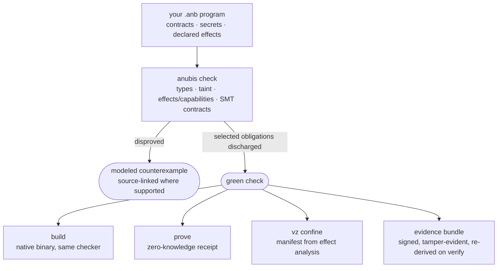

<div align="center">


<br><br>

[](https://github.com/AnubisQuantumCipher/anubis-lang/actions/workflows/ci.yml)
[](https://github.com/AnubisQuantumCipher/anubis-lang/releases/latest)


*A green `anubis check` reports the obligations the current checker discharged. Known false
accepts and deferred classes are listed in [`docs/CLAIMS.md`](docs/CLAIMS.md). A passing verdict
does not establish whole-program soundness.*

</div>

---

## What Anubis is

Software's most consequential claims — *"this is correct," "this is secure," "this exploit is real,"
"this ran in isolation"* — are almost always **asserted**. Rarely **proven**. Never **handed to you
as an artifact you can re-check yourself.**

**Anubis is a systems language for checking claims and recording evidence.** Its checker,
counterexamples, proof receipts, signed bundles, and isolation plans cover different,
documented parts of the language. A passing check is bounded by modeled obligations and
the [known open issues](docs/CLAIMS.md).

It is deliberately **dual-use**, because the two people who most need un-fakeable truth stand on
opposite sides of the same program: the **builder** proving a system is correct and confined, and the
**researcher** proving one is broken with an accountable proof-of-concept. Both trade in truth that
survives adversarial scrutiny.

Anubis aims to reduce its trusted base. It has a native SMT solver and Lean models, with a
production-linked check for the SecurityLabel component. Z3 is still required for some
solver paths, and the full Rust-to-proof connection remains unfinished. A bounded VM
self-hosting fixpoint has historical evidence; full current self-hosting remains unfinished.
See [capability boundaries](docs/CAPABILITIES.md).



---

## The counterexample it hands you

A type system can identify a wrong *shape*. For modelable failed obligations,
Anubis can also show a counterexample value.

A ring buffer's slots-in-use is `tail - head`. Correct in mathematics; a bug in fixed-width code —
once the buffer wraps and `tail < head`, the count goes negative. So you state the invariant:

```rust
fn ring_used(head: u32, tail: u32) -> u32
    ensures(result >= 0)
{
    return tail - head;
}
```

`anubis check` does not shrug and say "unproven." It **disproves** the claim with the wraparound
state your tests never hit:

```
$ anubis check examples/showcase/ring_buffer_underflow.anb
ANUBIS_ASSERTION_DISPROVED: 1 assertion(s) disproved by counterexample:
  ensures:(bvsge (bvsub anb_tail anb_head) (_ bv0 64))
  counterexample:
    head = 0x00000000c0000000  (3221225472)
    tail = 0x0000000000000000  (0)
```

Fix it — subtract only where it can't underflow — and the **same solver proves the fix correct**.

> **Honest boundary.** Anubis's `u32` is a bounded 64-bit integer with *signed* arithmetic, so the
> failure it proves is "the count goes below zero," not "wraps to 4 billion" — the same bug, stated
> in the language's real semantics. An obligation the solver cannot decide within budget also fails
> closed. Runtime still wraps unless you bound inputs.

---

## Quick start

The pinned Rust toolchain, a native compiler, and Z3 for fallback solver paths are
required; see [installation](docs/INSTALL.md). The separate hosted Linux ordinary
lane has a bounded x86_64/AArch64 success at `a00387d9`, but Omarchy installation
and the full Linux release gates remain open. IFC v2 participates in every Safe-mode
check on this branch; the [round-2 registration](docs/evidence/ROUND2_REGISTRATION_2026-09-26.md)
shows why the earlier zero-silent-accept count applies only to then-registered cases.

```bash
git clone https://github.com/AnubisQuantumCipher/anubis-lang.git && cd anubis-lang
cargo build --release -p anubis        # binary at ./target/release/anubis; the pinned
                                       # toolchain (rust-toolchain.toml) is selected for you
# Prefer ./target/release/anubis over bare `anubis` — a shell alias may hijack the name.

./target/release/anubis check examples/hello.anb
./target/release/anubis run   examples/hello.anb                             # → hello from anubis
./target/release/anubis check examples/showcase/ring_buffer_underflow.anb    # real counterexample
./target/release/anubis check <yours>.anb --suggest-contracts                # infer requires/ensures
./target/release/anubis check <yours>.anb --message-format=json              # machine-readable verdict
```

### The verdict says what it is worth

A pass states how much of itself was discharged by a machine-checked refutation
and how much rests on the solver's word, and names the obligations that have no
refutation at all:

```
check passed
certificates: 9/10 obligations discharged by a machine-checked refutation; 1 trusted to the
solver with none (checked in this run and not retained; --evidence writes them)
  no witness (REG-002, out of the proven fragment): ensures:(bvsge (bvsdiv anb_a anb_b) (_ bv0 64))
```

`--message-format=json` emits the same verdict as JSON Lines on stdout and nothing
else, one object per refusal and then a summary. It keeps *disproved*, where a
counterexample exists, apart from *undecided*, where there is neither a proof nor
a counterexample, because those call for different repairs. The schema and what it
deliberately refuses to carry are in
[`docs/language/DIAGNOSTICS_JSON.md`](docs/language/DIAGNOSTICS_JSON.md).

> **Honest boundary, twice over.** First: a plain `check` VERIFIES each
> refutation in process and then discards it. Nothing is written, so nothing can
> be re-checked by anyone afterwards — `--evidence` is what retains the
> certificates, and the verdict says which happened. Second: even a retained
> refutation only shows that *that CNF is unsatisfiable*. Nothing yet binds the
> CNF to its SMT query or the query to the source, so end-to-end verification is
> not what the ratio claims. See
> [`docs/PROOF_CORRESPONDENCE.md`](docs/PROOF_CORRESPONDENCE.md).

Full install notes: [`docs/INSTALL.md`](docs/INSTALL.md) · then the
[tutorial](docs/language/TUTORIAL.md).

---

## What it can do

Seven capability groups, each with an honest status and a named boundary. The detail — including
what is currently **open** — is in **[`docs/CAPABILITIES.md`](docs/CAPABILITIES.md)**.

| | Group | In one line |
|---|---|---|
| 🛡️ | **Verify** | `requires`/`ensures`/`assert` discharged by SMT, with real counterexamples — on a native, Lean-verified solver with **zero external dependencies** |
| 🔒 | **Secure by construction** | `secret<T>` and `tainted<T>` make a leak a compile error; linear use-once capabilities; the lethal-trifecta check |
| 🧾 | **Prove** | `anubis prove --backend risc0` — a real zkVM receipt, with private witnesses that stay off the journal |
| 🧱 | **Confine** | `anubis vz confine` derives a hypervisor isolation manifest **from the program's proven effect set** |
| ⚔️ | **Research** | an engagement-scoped offensive toolchain for authorized work, every action hash-chained into a receipt |
| 📦 | **Evidence & packages** | tamper-evident bundles, Ed25519 signing, and dependencies whose effect/taint/contract summaries are re-derived at your call sites |
| 🧰 | **Run & self-host** | Turing-complete executable core, **213 builtins**, LSP/fmt/REPL/tree-sitter, and a stage0→stage3 self-host spine |

**See it work:** [`docs/EXAMPLES.md`](docs/EXAMPLES.md) — including
[NEXUS](examples/showcase/nexus/), a 475-line secure AI agent whose safety properties are compiler
errors rather than prompt instructions, and [Anubis Vault](examples/showcase/anubis_vault/), a
high-threat password manager.

---

## Where it actually stands

Pre-1.0, under active development, and **honest about being unfinished**. Two things to understand
before you read any number here:

**1. Green means no *known* defects — not no defects.** A full green gate is an empty *published
residual inventory*. Absence of a red row is not evidence of absence. The project says this about
itself, in [`docs/CLAIMS.md`](docs/CLAIMS.md), and means it.

**2. Published inventory numbers are checked against the tree.** The docs-drift gate compares
counted and declared fixture rosters — security **356/356**, language **271/271**, stdlib fail-closed **104/104** —
along with a native-authoritative corpus of **968 files**, **213 builtins**, and 199 Lean 4 theorems across 16 modules. These are written
inventory claims; fixture, native-comparison, and formal PASS verdicts require separate
source-bound gate receipts:

```bash
bash scripts/run_docs_drift_gate.sh    # checks declared inventories and selected claim phrases
bash scripts/audit_unified.sh          # the full gate set
bash scripts/run_formal_gate.sh        # the Lean theorem check
```

**3. Hosted CI is a bounded witness, not the sealed Apple/VZ result.** The
`hosted-gate-witness` job installs the pinned Lean toolchain and evaluates the named 31-gate roster.
Every host-verifiable gate must pass; `G9_poc_kit` remains exactly `EXTERNAL`, and G14 is limited to
its non-executing host-isolation witness. A green badge therefore means `HOSTED_PASS`, not a Tart/VZ
seal or require-Metal proof. Those lanes are deliberately out of CI until a dedicated hardened
runner exists; see [`docs/CI_TRUST_BOUNDARY.md`](docs/CI_TRUST_BOUNDARY.md). Check the exact report
and commit rather than inferring scope from the badge:

```bash
gh run list --workflow anubis-ci --status completed --limit 1 --json conclusion,displayTitle
bash scripts/audit_unified.sh --profile hosted --out out/hosted  # the hosted contract locally
```

The phase-by-phase arc lives in [`docs/language/ROADMAP.md`](docs/language/ROADMAP.md); the
authoritative open-issue list — the one that wins over every other document, including this one — is
[`docs/CLAIMS.md`](docs/CLAIMS.md).

---

## Documentation

**Start at [`docs/README.md`](docs/README.md)** — it routes you by what you came to do, and tells you
what you can safely skip. You do not need to read the audit trail to use the language.

| I want to… | Go to | Time |
|---|---|---|
| **use Anubis** | [Install](docs/INSTALL.md) → [Tutorial](docs/language/TUTORIAL.md) → [`LANGUAGE.md`](LANGUAGE.md) → [CLI](docs/CLI.md) | ~40 min |
| **decide whether to trust it** | [Capabilities](docs/CAPABILITIES.md) → [Claims](docs/CLAIMS.md) → [vs SPARK](docs/SPARK_VS_ANUBIS.md) | ~30 min |
| **audit it / hunt a false accept** | [Claims](docs/CLAIMS.md) in full → [Roadmap](docs/language/ROADMAP.md) → [Maturity matrix](MATURITY_CLAIM_MATRIX.md) | hours |
| **work on the compiler** | [CONTRIBUTING](CONTRIBUTING.md) → [AGENTS](AGENTS.md) → [Architecture map](ARCHITECTURE_MAP.md) | — |
| **do authorized security research** | [Offensive platform](docs/language/OFFENSIVE_PLATFORM.md) → [PoC kit](docs/language/POC_KIT.md) → [`SECURITY.md`](SECURITY.md) | — |

Superseded plans and closed seals live in [`docs/history/`](docs/history/) — nothing there is a
current claim.

---

## License & community

- **License** — **Business Source License 1.1** ([`LICENSE`](LICENSE)): source-available to read,
  evaluate, and build on for any **non-production** purpose, converting to **Apache-2.0** on the
  Change Date. Production or commercial use before then needs a commercial license — contact
  **sic.tau@pm.me**. Deliberately source-available, not yet OSI open-source.
- **Contributing** — every change carries its own evidence and lands only when the gates stay green.
  See [`CONTRIBUTING.md`](CONTRIBUTING.md) and [`CODE_OF_CONDUCT.md`](CODE_OF_CONDUCT.md).
- **Security** — found a case where a green `anubis check` certifies something `anubis run`
  violates — a **false accept**? That is the bug class that matters most here. Report it privately
  per [`SECURITY.md`](SECURITY.md).
- **Repository note** — the tree vendors a patched RISC Zero (`vendor/`, wired via
  `[patch.crates-io]`) so the zkVM cold-verify gate reproduces from source; that accounts for most of
  the repo's size.

---

<div align="center">

**Program permissions should rest on independently checkable evidence. Production-linked
proof coverage and full self-hosting remain work to complete.**

</div>
